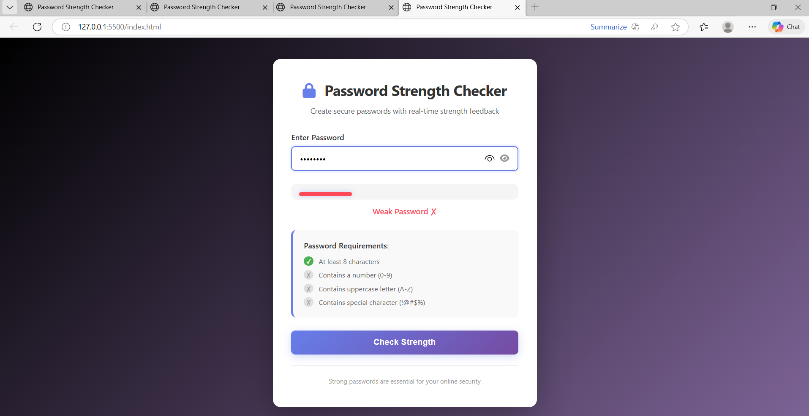
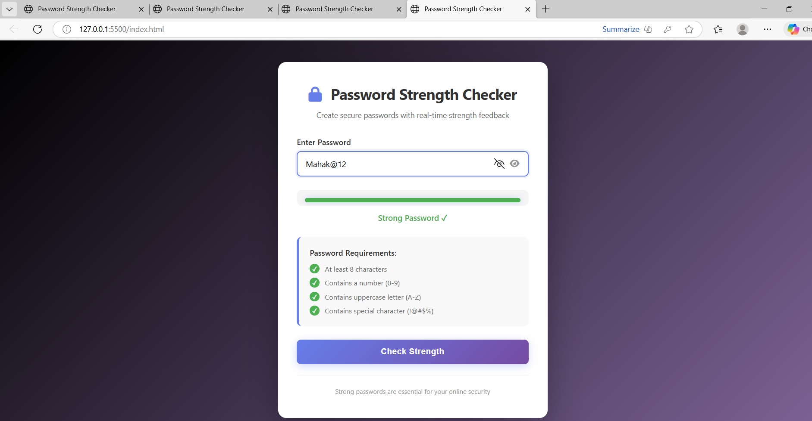

# Password Strength Checker 🔐

## 🎯 Project Goal
A modern and interactive web app that helps users create strong passwords by checking their strength in real time.  
It visually shows password requirements (length, numbers, uppercase letters, special characters) and provides instant feedback with a color-coded strength bar.

---

## ⚙️ Setup Instructions
1. Download or clone this repository.
2. Open `index.html` directly in any browser (no server needed).
3. Type a password — the app will:
   - Update the strength bar color and width in real time.
   - Highlight password requirements.
   - Show strength status: Weak / Medium / Strong.
4. Press **Enter** or click **Check Strength** to recheck manually.

---

## 💡 How I Thought (Logic Explanation)
I wanted to make a password tester that not only shows strength but also **guides users visually**.  
To achieve this:
- Used **JavaScript regex** to test for:
  - Minimum length ≥ 8
  - At least one number
  - At least one uppercase letter
  - At least one special character  
- Created a **dynamic score system** (0–4).  
  - Each passed condition adds 1 point → determines bar width and color.  
- Added **requirement indicators (✓/✗)** for better clarity.  
- Integrated **Font Awesome icons** and **show/hide eye toggle** for UX improvement.

---

## 🧠 Challenges Faced
- Getting the **Enter key event** to trigger strength updates correctly.  
  ✅ Fixed by adding a `keypress` event listener on the input field.  
- Handling **real-time updates** while typing — required optimizing DOM updates to avoid flicker.  
- Making responsive design work on mobile (used CSS media queries).  
- Ensuring smooth bar animations using CSS transitions.

---

## 📸 Output Screenshots
*(Embed images directly into README — do not use links)*  
1. Weak password → red bar + ✗ indicators  
2. Medium password → orange bar + partial ✓  
3. Strong password → green bar + all ✓  
4. Show/hide password toggle in action  

---

## 🚀 Future Improvements
- Add a **copy password** button.  
- Add a **password generator** feature.  
- Include a **dark mode** toggle.  
- Strength meter with text like “Very Strong” or “Needs improvement”.

---

## 🧩 Tech Stack
- **HTML5** → Structure  
- **CSS3** → Styling and animation  
- **JavaScript (ES6)** → Logic and DOM updates  
- **Font Awesome** → Icons  

---

👩‍💻 **Created by:** Urvashi Meena  
📅 *For Fresher Hiring Challenge Submission*

## 📸 Output Screenshots

### 🟥 Weak Password

### 🟧 Medium Password

### 🟩 Strong Password

